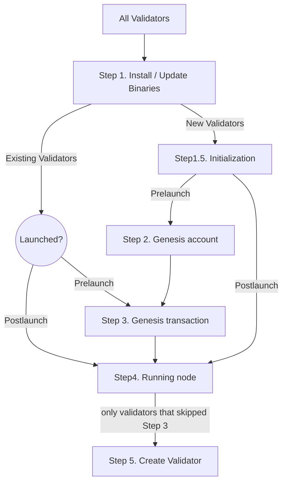

# Microtick Mainnet Instructions

Microtick is approaching its scheduled mainnet launch Wednesday, July 29, 2020 8:00 pm UTC. Follow these instructions to ensure your validator is prepared!

**Important**:

If your address is on this list: https://microtick.com/mainnet-genesis.html, then you are an **Existing Validator**. If not, you are a **New Validator**.

If the current time is before Wednesday, July 29, 2020 8:00 pm UTC, the network is in **Prelaunch**. Otherwise, it is **Postlaunch**.

**Never delete your private keys (contained in $HOME/.microtick by default) unless you're sure of what you are doing**



## Step 1 - Install / Update Binaries

Everyone should perform the following SETUP steps (binaries have been updated to v1.0.0)

SETUP-1. Download the release binaries and .sig file for v1.0.0 from https://microtick.com/releases/mainnet/

SETUP-2. Extract the archive and verify MD5 checksums and signature:

```
$ keybase verify -i microtick-v1.0.0-linux-x86_64.tar.gz -d microtick-v1.0.0-linux-x86_64.tar.gz.sig
Signed by microtickzone
$ tar xf microtick-v1.0.0-linux-x86_64.tar.gz
$ md5sum mtcli
c3d2d334ed0e4d6d3b966cb836876a38  mtcli
$ md5sum mtd
5edd2dbccfd67c5fac51a1e68cd5dfef  mtd
```

SETUP-3. Ensure the binaries 'mtd' and 'mtcli' are in your PATH

```
$ mtcli version --long
name: Microtick
server_name: mtd
client_name: mtcli
version: v1.0.0
commit: 13c5059c68a7322fa6da41d6031ebc8d3f9f575b
build_tags: build_host=manticore;build_date=Wed 22 Jul 2020 07:10:17 AM MDT
go: go version go1.14 linux/amd64
```

## Step 1.5 Initialization

SETUP-4. Choose a moniker and initialize the working directory:

```
$ mtd init <moniker>
```

SETUP-5. Create a validator key (if you do not already have one)

```
$ mtcli keys add validator
```

Note: if you're using a Ledger HW wallet for your validator operator account, use the following command instead:

```
$ mtcli keys add validator --ledger
```

## Step 2 Genesis Account - COMPLETE BY Friday, July 24, 2020 11:00 pm UTC

New validators should perform the following ACCOUNT steps:

ACCOUNT-1. Find your validator address to receive genesis TICK tokens:

```
$ mtcli keys show validator -a
micro17x67yaxc4vgxmpn6pqpczqh7l8942wvyhfqe6w
```

ACCOUNT-2. Register for the Microtick mainnet by following the instructions here: https://microtick.com/mainnet-genesis.html

The first 20 public genesis accounts will be awarded 20000 stake tokens (TICK). After the first 20 slots are filled, validators
will share a pool of 100000 tokens, with no single validator receiving more than 10000.

## Step 3 Genesis Transaction - COMPLETE BY Tuesday, July 28, 2020 11:00 pm UTC

All validators should perform the following GENTX steps (skip to Step 4 if network has Launched):

GENTX-1. **VERY IMPORTANT** After midnight UTC on Friday, July 24 and before Tuesday, July 28, 2020 11:00 pm UTC, ensure sure you have the final genesis.json with all the starting account balances:

```
$ git clone https://gitlab.com/microtick/validator.git
$ cd validator
$ git checkout mainnet
$ git pull
```

GENTX-2. Copy the final genesis.json file in this directory to $HOME/.microtick/mtd/config (backup the existing one if desired)

```
$ cp genesis.json $HOME/.microtick/mtd/config
```

GENTX-3. Remove any existing gentxs:

```
$ rm -r $HOME/.microtick/mtd/config/gentx
```

GENTX-4. Choose your parameters (https://hub.cosmos.network/master/validators/validator-faq.html) and create your genesis tx (this assumes you have your validator key set up using mtcli as described in Step 1)

```
$ mtd gentx --amount <self delegation amount> 
            --commission-rate <your commission rate> 
            --commission-max-rate <max rate>
            --commission-max-change-rate <max change rate>
            --min-self-delegation <self delegation parameter>
            
            ... include any other parameters such as website, details, identity, security contact, etc ...
            
            --name <your validator key's name as shown by 'mtcli keys list'>
            
Genesis transaction written to "~/.microtick/mtd/config/gentx/gentx-xyz.json"
```

Example values:
```
amount: 1000000utick (1 million uticks = 1 tick)
commission rate: 0.1 (for 10% commission)
commission max rate: 0.2 (for 20% commission)
min self delegation: 1 (for 1 tick)
```

GENTX-5. Create a pull request with your gentx in the "gentx" directory in this repository.

## Step 4 - MAINNET LAUNCH - COMPLETE PRIOR TO Wednesday, July 29, 2020 8:00 pm UTC

All validators should perform the following RUNTIME steps

RUNTIME-1. **VERY IMPORTANT** After midnight UTC Tuesday night, update to the latest genesis.json that includes everyone's gentxs.

```
$ git checkout mainnet
$ git pull
$ cp genesis.json $HOME/.microtick/mtd/config
```

RUNTIME-2. Edit $HOME/.microtick/mtd/config/config.toml. Change the seeds line to:

```
seeds = "922043cd83af759dd5a0605b32991667e8fd4977@45.79.207.112:26656,52333a93f5154422c62c2d654f2ca0f02129eaf2@microtick.spanish-node.es:6868"
```

RUNTIME-3. Start your node and leave it online for genesis time. You should not need to be present or awake at genesis time, as long as your node is running. (but being online might be beneficial in case problems occur)

```
$ mtd unsafe-reset-all
$ mtd start
```

## Step 5 - Create Validator

**Only validators that are joining after the network start need to do this step**

CREATE-1. Wait until node is synced. Make sure 'jq' is installed (```apt-get install jq``` on debian / ubuntu). The following command should return 'false' when synced:

```
$ mtcli status | jq .sync_info.catching_up
false
```

CREATE-2. Follow the instructions here to add your validator address: (https://microtick.com/mainnet-genesis.html)

CREATE-3. After receiving tokens, choose your parameters (https://hub.cosmos.network/master/validators/validator-faq.html) and create your validator:

```
$ mtcli tx staking create-validator --amount <self delegation amount>
                                    --pubkey $(mtd tendermint show-validator)
                                    --moniker <the name you'll call your validator> 
                                    --commission-rate <rate>
                                    --commission-max-rate <max rate> 
                                    --commission-max-change-rate <max change rate> 
                                    --min-self-delegation <min self delegation>
                                    --from $(mtcli keys show validator -a)
                                    --gas auto
                                    --chain-id <the current chain id>
```

Example values:
```
amount: 1000000utick (1 million uticks = 1 tick)
commission rate: 0.1 (for 10% commission)
commission max rate: 0.2 (for 20% commission)
min self delegation: 1 (for 1 tick)
name: "Choose a Name" (do not use this for real, think up something better...)
```
