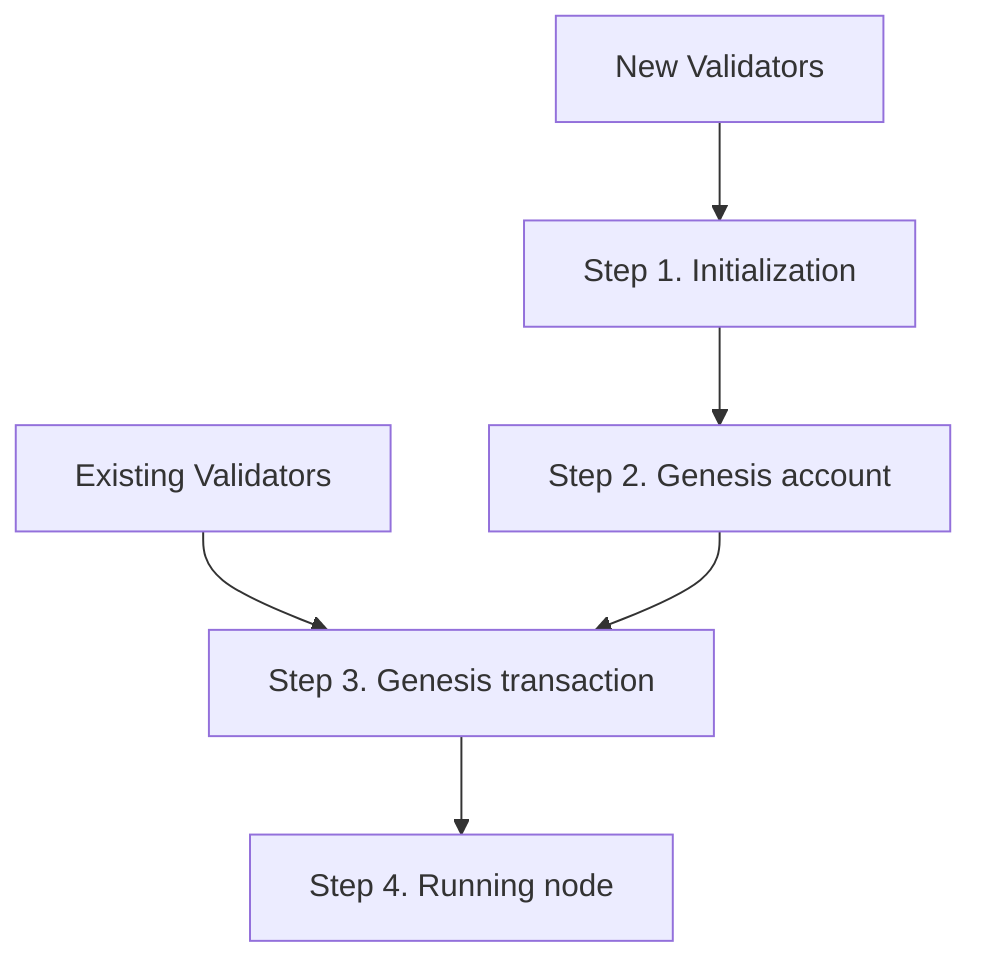

# RC6-2 Testnet Instructions



## Step 1 - Initialization

If you DO NOT yet have a running node, perform the following SETUP steps:

SETUP-1. Download the release binaries from https://microtick.com/releases/testnet/

SETUP-2. Extract the archive and verify MD5 checksums.

```
$ tar xf microtick-rc6-linux-x86_64.tar.gz
$ md5sum mtcli
1e7faf1e28d65be8041c3836074fee76  mtcli
$ md5sum mtd
6b07e5e9714a9c132ccf7f87e0caa0fc  mtd
```

SETUP-3. Ensure the binaries 'mtd' and 'mtcli' are in your PATH

SETUP-4. Choose a moniker and initialize the working directory:

```
$ mtd init <moniker>
```

SETUP-5. Create a validator key

```
$ mtcli keys add validator
```

## Step 2 Genesis Account - COMPLETE BY Saturday, June 20, 2020 11:00 pm UTC

New validators should perform the following ACCOUNT steps:

ACCOUNT-1. Find your validator address

```
$ mtcli keys show validator -a
micro17x67yaxc4vgxmpn6pqpczqh7l8942wvyhfqe6w
```

ACCOUNT-2. Send your address (the output from the previous command) as the subject line to: mjackson@microtick.com

All public genesis accounts will be awarded 20000 stake tokens (TICK)

## Step 3 Genesis Transaction - COMPLETE BY Sunday, June 21, 2020 11:00 pm UTC

All validators should perform the following GENTX steps:

GENTX-1. **VERY IMPORTANT** After Saturday, June 20, 2020 11:00 pm UTC, ensure sure you have the final genesis.json with all the starting account balances:

```
$ git clone https://gitlab.com/microtick/validator.git
$ cd validator
$ git checkout testnet-rc6-2
$ git pull
```

GENTX-2. Copy the final genesis.json file in this directory to $HOME/.microtick/mtd/config (backup the existing one if desired)

```
$ cp genesis.json $HOME/.microtick/mtd/config
```

GENTX-3. Remove any existing gentxs:

```
$ rm -r $HOME/.microtick/mtd/config/gentx
```

GENTX-4. Create your genesis tx (this assumes you have your validator key set up using mtcli)

```
$ mtd gentx --amount <self delegation amount> 
            --commission-rate <your commission rate> 
            --commission-max-rate <max rate>
            --commission-max-change-rate <max change rate>
            --min-self-delegation <self delegation parameter>
            
            ... include any other parameters such as website, details, identity, security contact, etc ...
            
            --name <your validator key's name as shown by 'mtcli keys list'>
            
Genesis transaction written to "~/.microtick/mtd/config/gentx/gentx-xyz.json"
```

GENTX-5. Email your gentx file (the output of the previous step indicated by the filename in quotes on the last line) as an attachment to mjackson@microtick.com

## Step 4 - Running Node - COMPLETE PRIOR TO Monday, June 22, 2020 11:00 pm UTC

All validators should perform the following RUNTIME steps

RUNTIME-1. After Saturday, June 20, 2020 11:00 pm UTC, edit $HOME/.microtick/mtd/config/config.toml. Change the persistent_peers line to:

```
persistent_peers = "922043cd83af759dd5a0605b32991667e8fd4977@45.79.207.112:26656,48ba6c0308f8687083ede2012d2ad2c969d2ead8@microtick.spanish-node.es:6868"
```

RUNTIME-2. Start your node and leave it online for genesis time. You do not need to be present or awake at genesis time, as long as your node is running.

```
mtd start
```

